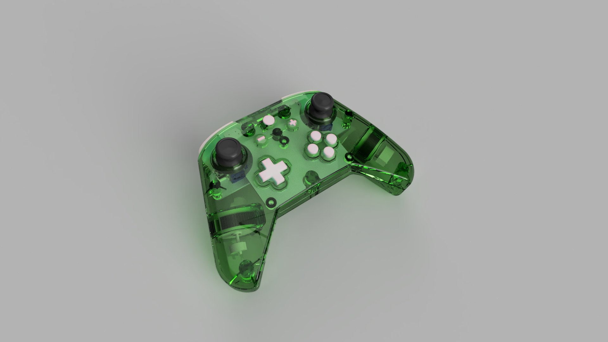

# Xii-U Controller
An Xbox One style controller with a Wii U layout!

The Wii U gamepad layout is a fan-favourite for many gamers yet it is rarely used in the current generation of controllers. This open source project brings the Wii-U layout back but in a shape more akin to an Xbox controller and provides you with a cool piece of tech that you can be proud to say you built yourself!

Features:
- Wii-U controller layout
- Hall Effect Joysticks
- Hall Effect Triggers
- Rumble
- Xinput Compatible
- RGB Status indicator home button

For now, this controller is wired only but I plan to add a wireless version of the design at some point in the future!

# Print Orientation

If you're printing the housing at home on an FDM printer here's some tips to get the best finish possible!

#### Front Housing

Stand the front housing on its top edge and lean it forward 45 degrees. Enable supports for surfaces over 55 degrees and use a raft to ensure good adhesion to the bed. Ensure Z seam is on the inside! Only minimal supports should be generated, just to support the bottom of the button holes. If you're using a bed-slinger, orient your part so that it runs with the direction your bed moves to reduce wobble.

#### Rear Housing

Stand the rear housing on its top edge and lean it back 30 degrees. Enable supports for surfaces over 55 degrees and use a raft to ensure good adhesion to the bed. Ensure Z seam is on the inside! Some supports will be generated on the inside but none are in contact with critical surfaces making cleanup relatively easy. Same as the front, ensure orientation matches your bed movements for bed slinger printers!

#### Shoulder Buttons

Shoulder buttons should be printed flat on the bed, to ensure the spring is working with the layers rather than against them. Enable supports so the top edge of the buttons aren't left hanging.

#### Trigger Buttons

Stand trigger buttons on their end and rotate forward 30 degrees. Enable supports for surfaces over 55 degrees and enable raft. Supports should be generated in the holes and for the magnet mount only leaving very little cleanup required.

# Bill of materials

#### PCB's

1x Front PCB (Must use ENIG finish!)

1x Rear PCB

#### 3D Printing

1x Controller Housing Top

1x Controller Housing Bottom

1x LHS Shoulder Button

1x LHS Trigger

1x RHS Shoulder Button

1x RHS Trigger

#### Purchase

1x Switch lite button set - https://www.aliexpress.com/item/1005007266706005.html

1x Switch lite membrane set - https://www.aliexpress.com/item/1005004544710872.html

2x PS5 Hall sensor joysticks - https://www.aliexpress.com/item/1005007688806322.html

1x Xbox rumble motor (pair) - https://www.aliexpress.com/item/1005006375129706.html

2x PS4/5 Trigger Springs - https://www.aliexpress.com/item/1005005844578554.html

2x 3x1mm Neodymium Magnets - https://www.aliexpress.com/item/1005006619263188.html

1x USB Data Cable (End will be removed so only need to ensure it has the correct end for your device on one end of the cable)

#### Hardware

5x M3x5x5 Threaded Inserts

5x M2x3.2x3 Threaded Inserts

5x M3x8 SHCS Screws

6x M2x4 SHCS Screws

# PCB Assembly

#### Front PCB:

Follow the diagram below for locations of components. Pay close attention to orientation of parts U1, Y1, U7 and D1 as they can be fitted in the wrong direction and cause damage. Align marks on all these components with the alignment marks on the PCB.

